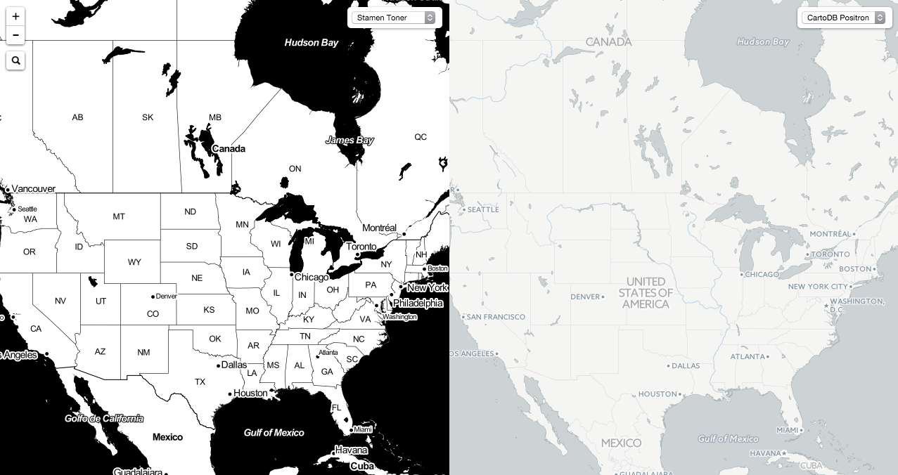

# Side by side leaflet

Yet another side-by-side Leaflet viewer.

## Configuration:

1. Add your own XYZ url templates in `sources.js`. Done!

## Credits:

Borrowed from [Andrew Harvey's](http://tianjara.net) gist [here](https://gist.github.com/andrewharvey/1194714) and his [live demo](http://tianjara.net/leaflet-side-by-side.html).

Extended with [Leaflet-hash](https://github.com/mlevans/leaflet-hash) by [Michael Evans](https://twitter.com/EvansML)

Adapted to function on [bl.ocks.org](bl.ocks.org) by [Alan McConchie](http://github.com/almccon/)